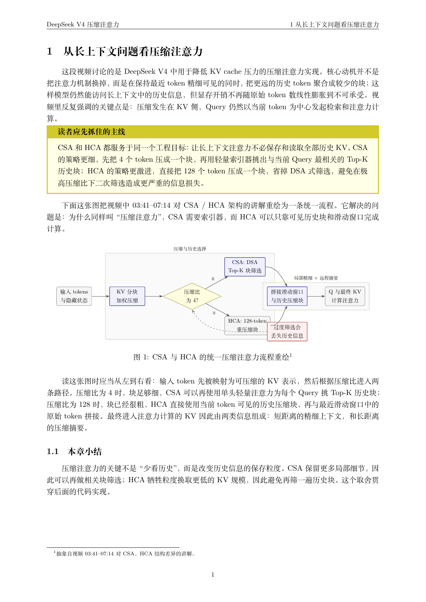
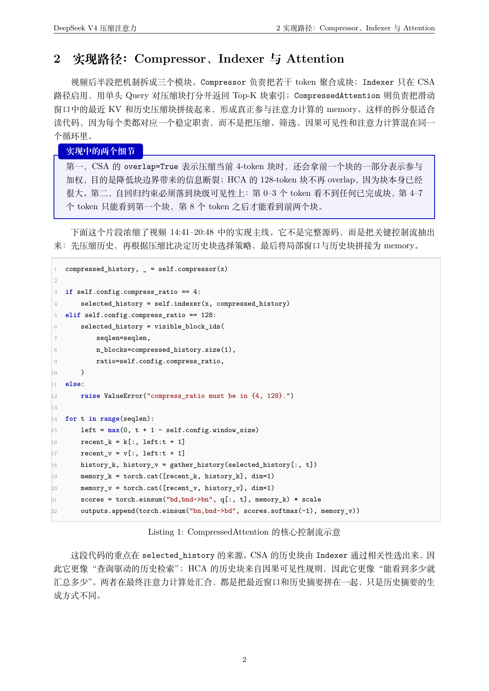

# video2note-skill

## 示例输出

以下两页示例来自本地视频 `37889117361-1-192.mp4` 的处理结果，内容主题是 DeepSeek V4 中的 CSA / HCA 压缩注意力机制。第一页展示基于视频讲解重绘的 LaTeX TikZ 流程图，第二页展示实现路径与核心代码摘录。





如果你是大语言模型（如 GPT、Claude 等），请阅读 [`SKILL.md`](SKILL.md)。

将 Bilibili、YouTube、TikTok 或 Douyin 等视频内容整理为结构化的中文 LaTeX 笔记，并最终渲染为 PDF。

仓库名和本地项目目录名为 `video2note-skill`；Skill 调用名仍保持 `video2note`。当前仓库采用根级 Skill 结构，`SKILL.md`、`agents/`、`assets/`、`runtime/` 和 `sops/` 都直接位于仓库根目录。

默认工作流包括：

- 使用 `faster-whisper` + `whisper-large-v3` 提取语音内容
- 使用 `PaddleOCR` + `PP-OCRv5` 提取图片中的文字内容（OCR）
- 当视频包含可用视觉素材时，提取封面、关键帧或重绘图作为插图
- 输出可编译的 LaTeX 文稿及最终 PDF

## 仓库结构

```text
video2note-skill/
  SKILL.md
  agents/
    openai.yaml
  assets/
    notes-template.tex
    tikz-styles.tex
    tikz-figure-template.tex
  runtime/
  sops/
    youtube.md
    bilibili.md
    tiktok-douyin.md
```

当前输入路由：

- YouTube：走 `sops/youtube.md`
- Bilibili：走 `sops/bilibili.md`
- TikTok / Douyin：走 `sops/tiktok-douyin.md`

## 安装

本仓库只提供 Skill 内容与运行时脚本源码，不绑定任何特定工具、安装器或平台私有目录。

你可以将当前仓库根目录按所用工具的约定安装到对应技能目录中；也可以直接读取其中的文档与脚本源码，自行集成到任意支持的工作流中。

## 运行时环境

`runtime/` 只是**运行时脚本源码目录**，不是实际运行环境目录。

唯一真实运行时应位于用户目录：

- 共享运行时根目录：`$HOME/video2note`；若当前 shell 未设置 `HOME`，则回退到 `$USERPROFILE/video2note`
- 共享虚拟环境：`$VIDEO2NOTE_HOME/.venv`
- 任务产出根目录：`${TMPDIR:-/tmp}/video2note`；若 `TMPDIR` 不存在，则回退到 `${TEMP}`、`${TMP}` 或 `/tmp/video2note`

运行时脚本源码目录中包含：

- `setup_runtime.sh`
- `env.sh`
- `transcribe_with_faster_whisper.py`
- `run_ppocrv5.py`
- `merge_chunked_transcripts.py`
- `resolve_dlpanda.py`

`source <runtime-scripts-dir>/env.sh` 后会导出：

- `VIDEO2NOTE_HOME`
- `VIDEO2NOTE_VENV`
- `VIDEO2NOTE_TMPDIR`
- `VIDEO2NOTE_RUNTIME_SCRIPTS_DIR`

## 说明

- 本仓库刻意排除了本地缓存、虚拟环境、转写结果、下载的媒体文件、提取图片及模型权重，不会将上述内容提交到 GitHub。
- 默认本地工作流不依赖任何 API Key。
- 共享运行时环境默认位于 `VIDEO2NOTE_HOME`，不会跟随 Skill 安装目录重复创建。
- `runtime/` 只是脚本源码位置，不应被描述为第二套运行时。
- 所有任务产物默认应写入 `VIDEO2NOTE_TMPDIR` 下的独立子目录，而不是写回 Skill 安装目录。
- 对于 Bilibili，高分辨率视频流可能需要浏览器 Cookie 才能下载。
- 对于 TikTok / Douyin，当前视频路径默认通过 `dlpanda` 解析 HTML 并提取直链媒体 URL，不依赖登录 Cookie。
- GPU ASR 只有在共享运行时已补齐 CUDA 依赖时才算可用；若出现 `libcublas` / `libcudnn` / `nvrtc` 缺失，应先补共享 venv。
- 对 `large-v3` 的真实长视频音轨，建议从更保守的 GPU `batch-size` 起步，再按显存逐步上探，而不是默认假设 `32` 稳定可用。
- 最终 PDF 默认应使用 `xelatex` 或 `latexmk -xelatex` 编译，而不是把 `pdflatex` 当作默认路径。
- 主输出目录、`.tex` 和 PDF 应根据视频主题命名为 5-10 个中文字符的语义化短名。
