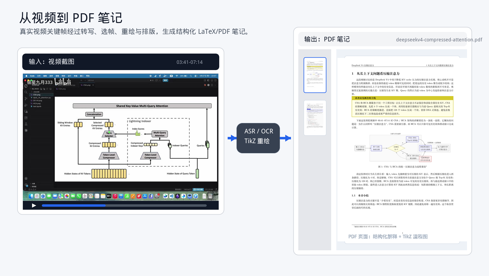

# video2note-skill

## 示例输出

下图示例来自本地视频 `37889117361-1-192.mp4` 的处理结果，内容主题是 DeepSeek V4 中的 CSA / HCA 压缩注意力机制。左侧是真实视频关键帧，右侧是生成后的 PDF 笔记页面，用来直观看到从视频素材到结构化 PDF 的转换效果。



如果你是大语言模型（如 GPT、Claude 等），请阅读 [`SKILL.md`](SKILL.md)。

将 Bilibili、YouTube、TikTok 或 Douyin 等视频内容整理为专家讲义型的中文 LaTeX 深度报告，并最终渲染为 PDF。

仓库名和本地项目目录名为 `video2note-skill`；Skill 调用名保持 `video2note`。本仓库采用根级 Skill 结构，`SKILL.md`、`agents/`、`assets/`、`runtime/` 和 `sops/` 都直接位于仓库根目录。

默认工作流包括：

- 使用 `faster-whisper` + `whisper-large-v3` 提取语音内容
- 使用 `PaddleOCR` + `PP-OCRv5` 提取图片中的文字内容（OCR）
- 同时保留 `subtitles/raw.srt` 原始证据轨和可选 `subtitles/clean.srt` 清洗阅读轨
- 先从 `assets/report-blueprints.md` 选择主蓝图，再从 `assets/depth-ladders.md` 选择本次必须下钻的分析层
- 在写 LaTeX 之前先生成 `analysis/outline.md`，把主题拆解为可检查的分析单元
- 只要素材支持，就覆盖“概念 → 机制 → 公式/指标/成本约束 → 架构/流程 → 行动建议”这条知识链
- 当视频包含可用视觉素材时，提取封面、关键帧或重绘图作为插图
- 对访谈、播客、圆桌类视频，可用 `dialoguebox` 保留短而高信息密度的原始对话片段，但它只作为证据块，不作为正文骨架
- 正式交付前生成 `coverage_review.md`，独立检查漏召回、误概括、文风跑偏、结构过粗和分析深度不足
- 输出可编译的 LaTeX 文稿及最终 PDF

## 工作流规定

### dialoguebox

模板内置 `dialoguebox`，只用于访谈、播客、圆桌或强对话视频中短而高价值的原话片段。使用时应保留说话人标签和时间区间；不要把长字幕块、寒暄或普通解释放入 `dialoguebox`。正文默认直接讲主题、机制和判断，`dialoguebox` 只是证据补充。

### 分析骨架

正式写作前默认先产出 `analysis/outline.md`。每个主题单元至少应包含：

- `question`
- `core_claim`
- `mechanism`
- `evidence_with_timestamps`
- `formula_or_metric`
- `cost_or_constraint_model`
- `architecture_or_decision_flow`
- `actionable_takeaways`

对于 35--60 分钟的访谈、圆桌、播客或 Q\&A 视频，默认先拆成 8--12 个主题单元，再进入正文整合。若某一层不适用，应在分析骨架中标记 `N/A` 并说明原因，而不是静默跳过。

推荐直接使用：

- `assets/analysis-outline-template.md`

### 蓝图与深度梯子

为了提高跨视频类型的稳定性，默认先选结构蓝图，再选分析深度：

- `assets/report-blueprints.md`：决定报告是按对谈、课程、系统架构还是职业/决策分析来组织
- `assets/depth-ladders.md`：决定这次必须下钻到哪些公式、成本、约束、流程或行动层

没有蓝图就直接写正文，或没有深度梯子就直接写总结，都视为流程不完整。

### 字幕双轨

只要存在平台字幕或 ASR 结果，工作流应保留：

- `subtitles/raw.srt`：原始证据轨，不覆盖，用于时间脚注、事实核查和漏召回审查。
- `subtitles/clean.srt`：可选清洗轨，只做字幕级纠错、去无意义语气词、必要断句和轻量停顿空格。

生成 `clean.srt` 后，应运行：

```bash
python "$VIDEO2NOTE_RUNTIME_SCRIPTS_DIR/check_clean_srt.py" \
  "$TASK_DIR/subtitles/raw.srt" \
  "$TASK_DIR/subtitles/clean.srt"
```

纯视觉模式不强造 `clean.srt`。

### coverage review

正式交付前应生成 `output/coverage_review.md`，对照原始字幕/ASR、清洗轨、`analysis/outline.md`、所选蓝图、所选深度梯子、关键帧清单和最终 `.tex`，只反馈问题，不直接改正文。重点检查四类护栏：文风是否跑回“视频复盘”、结构是否符合蓝图、分析是否真的按深度梯子下钻到公式/指标/成本约束/架构流程，以及是否给出可执行的判断框架或行动建议。若用户明确要求快速草稿，可以跳过，但交付时应说明。

推荐直接使用：

- `assets/coverage-review-template.md`

## 仓库结构

```text
video2note-skill/
  SKILL.md
  agents/
    openai.yaml
  assets/
    notes-template.tex
    analysis-outline-template.md
    report-blueprints.md
    depth-ladders.md
    coverage-review-template.md
    tikz-styles.tex
    tikz-figure-template.tex
  runtime/
    check_clean_srt.py
  sops/
    youtube.md
    bilibili.md
    tiktok-douyin.md
```

输入路由：

- YouTube：走 `sops/youtube.md`
- Bilibili：走 `sops/bilibili.md`
- TikTok / Douyin：走 `sops/tiktok-douyin.md`

## 安装

本仓库只提供 Skill 内容与运行时脚本源码，不绑定任何特定工具、安装器或平台私有目录。

你可以将仓库根目录按所用工具的约定安装到对应技能目录中；也可以直接读取其中的文档与脚本源码，自行集成到任意支持的工作流中。

## 运行时环境

`runtime/` 只是**运行时脚本源码目录**，不是实际运行环境目录。

唯一真实运行时应位于用户目录：

- 共享运行时根目录：`$HOME/video2note`；若当前 shell 未设置 `HOME`，则回退到 `$USERPROFILE/video2note`
- 共享虚拟环境：`$VIDEO2NOTE_HOME/.venv`
- 任务产出根目录：`${TMPDIR:-/tmp}/video2note`；若 `TMPDIR` 不存在，则回退到 `${TEMP}`、`${TMP}` 或 `/tmp/video2note`

运行时脚本源码目录中包含：

- `setup_runtime.sh`
- `env.sh`
- `transcribe_with_faster_whisper.py`
- `run_ppocrv5.py`
- `merge_chunked_transcripts.py`
- `resolve_dlpanda.py`
- `check_clean_srt.py`

`source <runtime-scripts-dir>/env.sh` 后会导出：

- `VIDEO2NOTE_HOME`
- `VIDEO2NOTE_VENV`
- `VIDEO2NOTE_TMPDIR`
- `VIDEO2NOTE_RUNTIME_SCRIPTS_DIR`

## 说明

- 本仓库刻意排除了本地缓存、虚拟环境、转写结果、下载的媒体文件、提取图片及模型权重，不会将上述内容提交到 GitHub。
- 默认本地工作流不依赖任何 API Key。
- 共享运行时环境默认位于 `VIDEO2NOTE_HOME`，不会跟随 Skill 安装目录重复创建。
- `runtime/` 只是脚本源码位置，不应被描述为第二套运行时。
- 所有任务产物默认应写入 `VIDEO2NOTE_TMPDIR` 下的独立子目录，而不是写回 Skill 安装目录。
- 对于 Bilibili，高分辨率视频流可能需要浏览器 Cookie 才能下载。
- 对于 TikTok / Douyin，视频路径默认通过 `dlpanda` 解析 HTML 并提取直链媒体 URL，不依赖登录 Cookie。
- GPU ASR 只有在共享运行时已补齐 CUDA 依赖时才算可用；若出现 `libcublas` / `libcudnn` / `nvrtc` 缺失，应先补共享 venv。
- 对 `large-v3` 的真实长视频音轨，建议从更保守的 GPU `batch-size` 起步，再按显存逐步上探，而不是默认假设 `32` 稳定可用。
- 最终 PDF 默认应使用 `xelatex` 或 `latexmk -xelatex` 编译，而不是把 `pdflatex` 当作默认路径。
- 主输出目录、`.tex` 和 PDF 应根据视频主题命名为 5-10 个中文字符的语义化短名。
